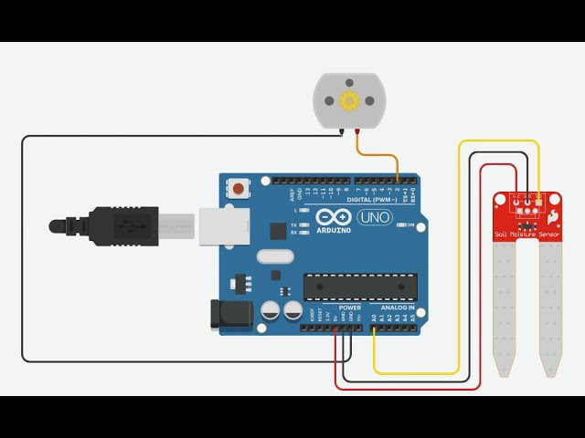

# 🌱 Automatic Plant Watering System

This project is an Arduino-based Automatic Plant Watering System that monitors the soil moisture level and automatically activates a water pump when the plant needs watering. Designed for hobbyists and students, this system automates irrigation and ensures plant health even in your absence.

---

## 📸 Project Preview

---

## 📌 Project Overview

- **Type**: Embedded Systems (IoT)
- **Platform**: Arduino Uno
- **Language**: C++ (Arduino)
- **Sensor**: Soil Moisture Sensor
- **Actuator**: Water Pump via Relay Module

---

## 🔧 How It Works

- The system checks soil moisture every **hour**.
- It takes **5 readings**, computes the **average**, and maps it to a **moisture percentage**.
- If moisture falls below **30%**:
  - Turns **on** the pump for **90 seconds**.
  - Turns **off** after irrigation.

---

## 🛠️ Hardware Components

| Component              | Quantity |
|------------------------|----------|
| Arduino Uno            | 1        |
| Soil Moisture Sensor   | 1        |
| Relay Module           | 1        |
| Submersible Water Pump | 1        |
| Jumper Wires           | —        |
| Breadboard (optional)  | 1        |
| Power Supply (USB/9V)  | 1        |

---

## 🔌 Circuit Diagram

> Make sure to connect the sensor and pump correctly to avoid short circuits. The relay isolates the microcontroller from the high-power components.

---

## 📁 Folder Structure

plant-watering-system/
├── code/
│ └── plant_watering.ino # Arduino sketch
├── images/
│ └── output.jpg # Output result photo
├── circuit_diagram/
│ └── circuit_diagram.png # Fritzing or hand-drawn circuit
└── README.md

---

## 🚀 Future Improvements

- Integrate real-time LCD to show current moisture level.
- Use Wi-Fi (ESP8266) to monitor data remotely via IoT dashboards.
- Send alerts via SMS or email when plants need watering.
- Solar-powered system for outdoor gardens.

---

## 🙌 Developed By

**Pinnamshetty Shashidhar**  
B.Tech in AI & ML | CMR Engineering College  
📧 [228r1a66b5@gmail.com](mailto:228r1a66b5@gmail.com)  
🔗 [GitHub](https://github.com/shashidharpb5) | [Portfolio](https://shashidharpb5.github.io)

---

> “Plants don’t text you when they’re thirsty, but now they don’t need to.” 🌿💧
